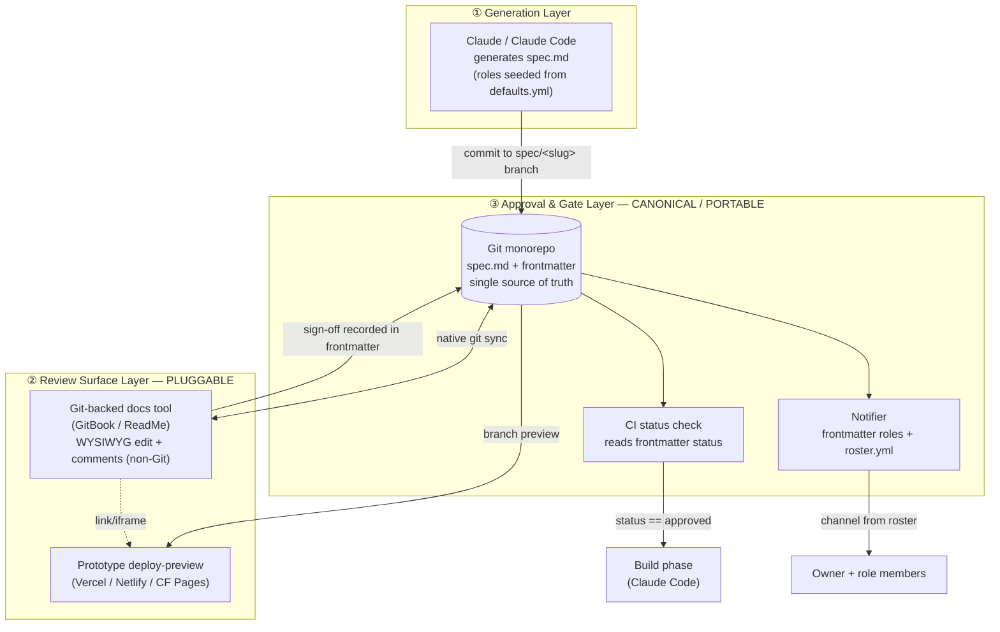
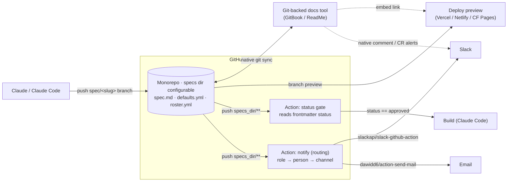
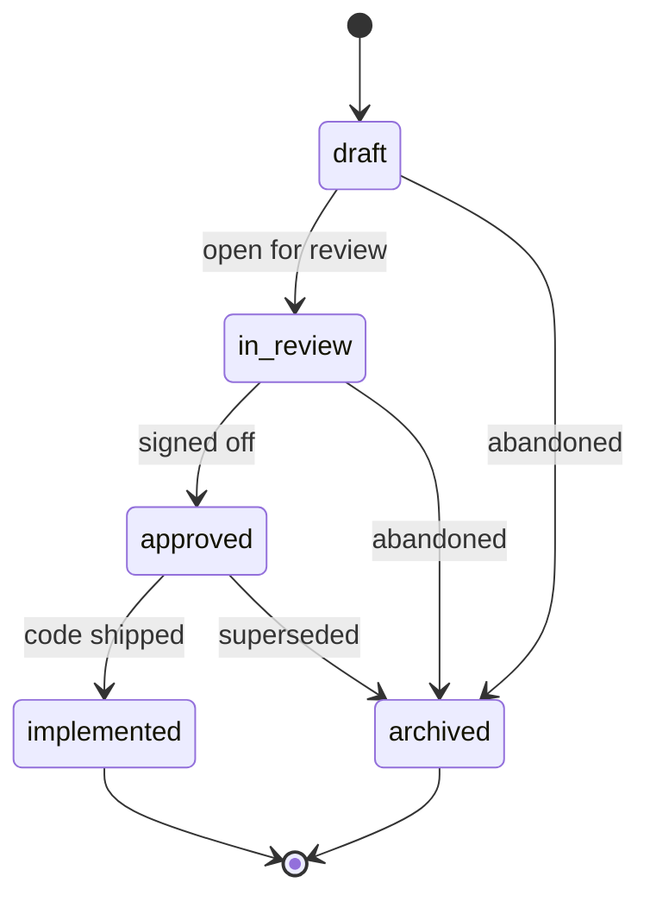
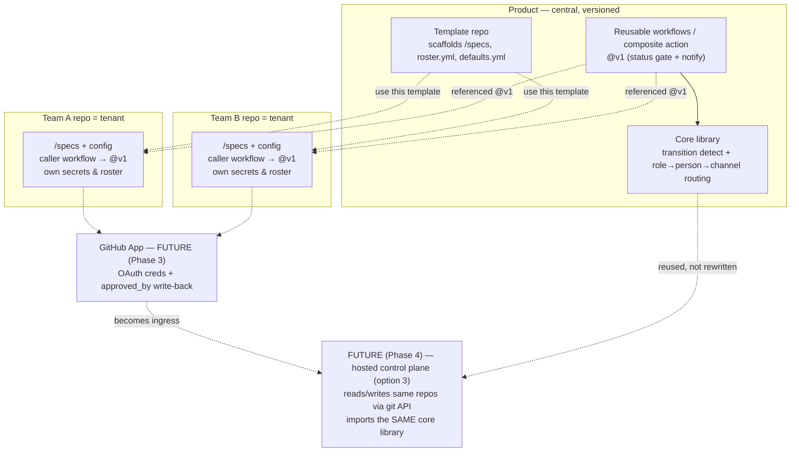
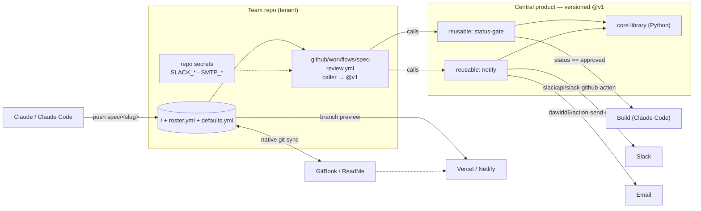
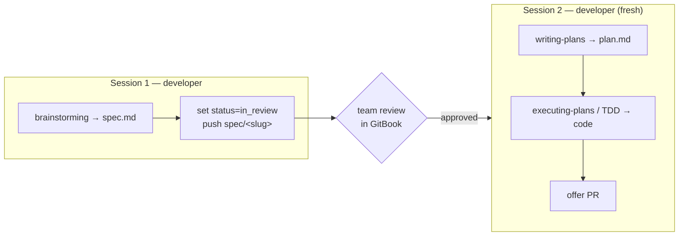

# Spec Review & Approval Workflow — System Specification

## 0. Handoff notes

This document is the **authoritative source spec** for building the system. It is
self-contained: all decisions are locked in §11, the build order is §10, and the
initial (Phase 1) architecture, install, and invocation details are in §13.

For the implementing session:

- **Generate an implementation `plan.md` from this spec**, then build in phase
  order (§10). Initial scope is **Phases 0–2 only**; Phases 3–4 are future.
- **Build the core library first** (§13.7, decision 13): Pydantic models for
  frontmatter/roster/defaults, two-commit transition detection (§7.4), and
  role→person→channel routing behind a sender interface — with a `--dry-run`
  mode and unit tests. The Actions wrap this library; they must not reimplement
  its logic.
- **Then** the two reusable workflows (`status-gate`, `notify`), **then** the
  template repo + scaffolder (writes `specs_dir` into the caller), **then** wire
  one real team repo end-to-end (GitBook + Slack) as the acceptance test.
- Docs tool = **GitBook** (git-branch support confirmed); Slack is the primary
  channel, email optional (§13.6).
- **Generation is authoring-tool-agnostic** (§14): the system contracts on a
  conformant spec on a `spec/<slug>` branch. Bare Claude Code works via
  `CLAUDE.md` + `/new-spec`; superpowers is an optional specialization.

---

## 1. Overview

A workflow that lets a single developer generate requirements, designs, and
build plans with Claude, then get quick, structured review from non-technical
team members (PM, UX, QA) **before code is written** — without duplicating the
spec across tools and without locking the team into any one documentation
product.

### 1.1 Goals

- Non-developers review and refine specs on a **fully non-Git surface**.
- The spec has **one canonical copy** — no duplication, no sync tax. Access and
  notification routing live **in the spec's own frontmatter**.
- Access is **role-based** (owner, approvers, commenters, viewers), specified
  per spec **by name only** — the tool resolves each person's channel from a
  central roster.
- Approval is **recorded and machine-readable** in git, so it can gate the build.
- The system is **agnostic to the (git-backed) documentation tool**; because the
  tool provides native git sync, swapping GitBook for ReadMe is a settings
  change, not a rearchitecture.
- **Installable by many teams, serverlessly.** Distributed as versioned reusable
  workflows + a template repo; each team installs into its own repo. Designed so
  a later move to a hosted multi-tenant service is additive, not a rewrite.
- **Authoring-tool-agnostic.** The system contracts on a conformant spec on a
  branch, not on any editor or agent — bare Claude Code, superpowers, or hand
  authoring all work identically (§14).

### 1.2 Non-goals

- Not migrating review *conversations* (comment threads) between tools. Those
  stay in whatever surface produced them and are treated as non-portable.
- Not replacing code review for the implementation itself. This covers
  everything *up to and including* the transition to `implemented`.
- Not a real-time co-authoring system. Review is asynchronous by default.
- Not (for now) notification de-duplication or reminders/escalation.

### 1.3 Team assumptions

Per team: 5–10 people in a **monorepo** — one or more developers (drivers), plus
PM, UX, and QA reviewers. High enough trust that approval can be a recorded team
decision rather than an enforced quorum; large enough that a verifiable record of
that decision is worth having. Across teams, **each team's repo is its own
tenant** (see §12).

---

## 2. Core principles

These are the load-bearing decisions. Everything else is an implementation
detail that can change without touching them.

1. **Git is the source of truth.** The spec, its plan, and its approval state
   all live as text in the repo.
2. **Frontmatter is the runtime contract.** Status, roles/access, and the
   sign-off trail all live in the spec's frontmatter — not in a branch, a PR, or
   a tool's internal state. A root-level default *seeds* new specs at creation,
   but once written the frontmatter is authoritative and self-contained; nothing
   else is consulted at review time.
3. **Access is role-based, specified by name.** The driver lists people under
   `approvers`, `commenters`, `viewers`; channels are resolved from `roster.yml`.
4. **The documentation tool is a pluggable editor, never the system of record.**
   The moment a tool's internal approval becomes authoritative, portability is
   lost. This never happens.
5. **The gate starts advisory and hardens to enforced.** Begin with humans
   honoring the status; add CI enforcement when the stakes grow.
6. **Docs tools are git-backed only.** In scope: tools whose source of truth is
   the git repo (GitBook, ReadMe). This deletes the sync problem — the tool *is*
   the bidirectional git sync.

---

## 3. Architecture

Three layers. The top two are swappable; the bottom is the portable spine that
holds the whole system's semantics.



**Reading it:** Claude writes the spec (roles and status in its frontmatter) to a
feature branch. That branch syncs into whatever docs tool the team uses, where
people with access review on a non-Git surface and click through to a hosted
prototype. Sign-off is recorded in the frontmatter in git (owner-set initially;
automatic once the GitHub App arrives, Phase 3). CI reads
`status`; the notifier routes events to role members, picking each person's
channel from the roster. Nothing in the canonical layer knows which docs tool
was used.

### 3.1 Concrete component view

With docs tools restricted to git-backed ones, **GitHub is the hub** and
everything else is a spoke. Almost every box is off-the-shelf; the only custom
code is one routing workflow.



| Component | Role | Build vs. buy |
|---|---|---|
| GitHub monorepo | Source of truth for specs, roles, roster | Buy |
| Action — status gate | Reads frontmatter, gates the build | ~30 lines |
| Action — notify | Detects transition, resolves role→person→channel, calls delivery | ~1 file |
| Git-backed docs tool (GitBook/ReadMe) | Non-Git review surface; native sync + comments | Buy |
| Deploy previews | Host clickable prototypes per branch | Buy |
| slackapi/slack-github-action | Slack delivery (channel or DM-by-email) | Buy |
| dawidd6/action-send-mail | Email delivery over SMTP | Buy |

The entire custom surface is **two Actions in the repo**. Nothing is hosted.

---

## 4. Data model

### 4.1 Repository layout (monorepo)

Schema-first: each feature is a self-contained folder. Roles and routing live in
`spec.md` itself, so there is no per-feature reviewers file to keep in sync. The
root folder is an **install-time parameter** (`specs_dir`, default `specs`), so a
team can place it wherever fits their repo — e.g. `docs/specs` (see §13.5).

```
<specs_dir>/                      # configurable; default: specs/
  roster.yml                      # central team roster: person → email/slack
  defaults.yml                    # default review assignment, seeded into new specs
  <feature-slug>/
    spec.md                       # canonical spec — frontmatter = roles + status
    plan.md                       # build plan
    design.md                     # design notes and/or Figma links
```

### 4.2 Spec frontmatter schema

The complete contract: status, role-based access, and the sign-off trail.

```yaml
---
title: string
status: draft | in_review | approved | implemented | archived
owner: person                # the driver; full control
approvers: [person, ...]     # may sign off; sign-off recorded in approved_by
commenters: [person, ...]    # may comment/suggest, not approve
viewers: [person, ...]       # read-only access
approved_by: [person, ...]   # who has actually signed off (subset of approvers)
approved_at: date | null     # set when status → approved
version: semver-ish
---
```

All people are **names only** (roster keys). The docs tool maps each role to its
own permission level, and the notifier resolves each name to a channel via
`roster.yml`. No channel is ever specified inline.

### 4.3 roster.yml (central team roster)

Single source for contact handles. The only place channels are defined.

```yaml
people:
  elena:   { email: elena@acme.com, slack: "@elena" }
  sam:     { email: sam@acme.com,   slack: "@sam" }
  chris:   { email: chris@acme.com, slack: "@chris" }
  qa-team: { slack: "#qa" }        # a group is fine; email optional
```

Channel selection default: use Slack if present, else email. A person missing
from the roster fails loudly (the owner is notified), never silently.

### 4.4 defaults.yml (default review assignment)

A root-level template applied to **new** specs at creation: its role lists are
copied into the new doc's frontmatter, then freely overridden per spec. It is a
seed, not a runtime fallback — after creation the spec's own frontmatter is the
only thing consulted.

```yaml
# Copied into a new spec's frontmatter at creation; edit per spec afterward.
owner: chris
approvers: [pm, lead-dev]
commenters: [ux, qa]
viewers: []
```

Precedence: any role explicitly set on the new spec wins; unset roles inherit
from `defaults.yml`. Changing `defaults.yml` never re-touches existing specs —
it only affects specs created afterward.

---

## 5. Spec lifecycle



| State | Meaning | Set by |
|---|---|---|
| `draft` | Being generated/edited; not yet up for review | Claude / owner |
| `in_review` | Live for reviewers; change request open | Owner (or sync on branch push) |
| `approved` | Team has signed off; ready to build | Owner, after sign-off |
| `implemented` | Code shipped against the approved spec | Owner |
| `archived` | Abandoned or superseded | Owner |

Revisions during `in_review` update the doc in place (no separate state). If an
approved spec needs rework, the owner moves it back to `in_review`.

---

## 6. Approval & the gate

### 6.1 Why frontmatter, not merge-to-main

Merge-to-main ties approval semantics to one branch/PR workflow that each docs
tool maps differently — coupling you to the tool. Frontmatter is plain text that
travels with the document, is human-readable, and is verifiable by CI
independent of any tool. Merge-to-main remains available as *optional
enforcement* (branch-protect `main`, make the status check the required status),
but it is never the source of truth.

### 6.2 Verification (CI status check)

Runs on every push under `<specs_dir>/<slug>/`:

```
on push to <specs_dir>/<slug>/:
    spec = parse_frontmatter(spec.md)

    if spec.status == "approved":
        emit_event("cleared_to_build", slug)   # → notify owner: "ready to build"
        # no automated build is triggered — the owner starts the build (Claude Code)
    else:
        # advisory mode: build warns but proceeds
        # enforced mode: block the build trigger until status == approved
```

`cleared_to_build` has a single consumer for now: a notification to the **owner**
that the spec is ready to build. Nothing runs automatically (human-in-the-loop);
the owner kicks off the build.

`approved_by` should be a subset of `approvers`. Optional hardening for later:
in enforced mode, require `approved_by ⊇ approvers` (every named approver has
signed off) before `status: approved` is honored, and restrict who may set that
status. Not needed while the gate is advisory.

### 6.3 Advisory → enforced

- **Advisory (start here):** build warns if `status != approved` but proceeds.
  The team honors the status socially; the record still exists in git.
- **Enforced (later):** CI blocks the build trigger until `status == approved`
  (optionally, until every approver has signed off).

Same representation both times. Hardening is a config flag, not a redesign.

---

## 7. Notifications

Routing is **derived from the frontmatter roles** — there is no separate routing
config. Each recipient's channel comes from `roster.yml`. Reminders and
escalation are out of scope for now.

### 7.1 Event → recipients (default convention)

| Event | Trigger | Notified | Payload |
|---|---|---|---|
| `ready_for_review` | Spec opened for review | approvers + commenters + viewers | Review link + prototype link + "what changed" |
| `commented` | A reviewer comments | owner | Comment link |
| `approved` | `status` set to `approved` | owner | "Ready to build" + approved commit |

Channel per recipient = roster default (Slack if present, else email). This
mapping is a fixed convention, not per-spec config; the driver controls *who* is
reached purely by which names go in which role.

### 7.2 Flow (who does what)

```mermaid
sequenceDiagram
    actor Driver
    participant Claude
    participant Repo as Git monorepo
    participant Docs as Docs tool
    actor Reviewers as approvers / commenters / viewers
    participant Notifier
    participant CI

    Driver->>Claude: "Generate spec; approvers=Elena,Lead; commenters=Sam,QA"
    Claude->>Repo: commit spec.md (roles in frontmatter) + plan.md (branch)
    Note over Claude,Repo: unset roles seeded from defaults.yml
    Repo->>Docs: native git sync → change request, permissions per role
    Repo->>Notifier: event: ready_for_review
    Notifier->>Reviewers: channel from roster + review & prototype links

    Reviewers->>Docs: read, comment, refine (non-Git)
    opt comment
        Repo->>Notifier: event: commented
        Notifier->>Driver: comment link
    end
    Reviewers->>Docs: approvers sign off (in tool)
    Driver->>Repo: record approved_by + set status = approved
    Note over Docs,Repo: auto write-back of approved_by is Phase 3 (App)
    Repo->>CI: status check
    CI-->>Repo: status == approved → cleared_to_build
    Repo->>Notifier: event: approved
    Notifier->>Driver: ready to build
    Driver->>Claude: build against approved spec
    Driver->>Repo: set status = implemented
```

### 7.3 Notification stack (off-the-shelf + thin routing)

You don't build a notification system — you assemble off-the-shelf delivery with
one small routing step.

- **Delivery (nothing hosted):**
  - Slack — a bot token via `slackapi/slack-github-action` for channel posts, or
    (for per-person DMs) the library calling `users.lookupByEmail` +
    `chat.postMessage` directly, keyed off the emails in `roster.yml`.
  - Email (optional) — SMTP via `dawidd6/action-send-mail`, **or** a transactional
    API (Resend / Postmark / SES) via an API key when SMTP creds aren't available.
    If neither is on hand, GitBook/ReadMe and GitHub emit their own emails
    (change-requests, review-requests, @-mentions) — see §13.6.
  - Zero-code option — the native Slack GitHub app (subscribe a channel to repo
    events); no per-person routing.
- **Custom glue (one workflow file, not a service):** a routing step
  (`actions/github-script` or a ~30-line script) that, on push to `/specs/**`,
  parses the changed spec's frontmatter, detects the status transition, resolves
  role → person (frontmatter) → channel (roster), and calls the delivery action.
- **Free coverage:** GitBook/ReadMe emit their own alerts for comments and change
  requests, so the `commented` event can come from the tool — the routing Action
  only needs to handle `ready_for_review` and `approved`.
- **Low-code alternative:** n8n / Zapier / Make can watch the repo and fan out
  visually; for a git-native team, Actions keeps everything in the repo.

### 7.4 Transition detection

Events fire on frontmatter *transitions*, not on every push. A push shows only
the new state, so the library compares the changed spec against its previous
version:

- **Trigger on spec branches only** — `on: push: branches: ['spec/**'], paths:
  ['<specs_dir>/**']`. All status changes (draft → in_review → approved) happen on
  the feature branch; `main` is the landing zone for approved specs and is **not**
  watched, so merging never re-fires an event.
- **Compare `before` vs `after`** — for each changed `spec.md`, read `status` from
  the push's `github.event.before` and `after` commits (`git show ${before}:<path>`
  vs current). Fire an event only when `status` changed, and only for the new
  status. (`before`/`after`, not `HEAD~1`, which breaks on multi-commit and merge
  commits.)
- **Edge cases** — new file (no `before` version) → transition into its initial
  status; body-only edit (status unchanged) → no event (this is the dedup); a push
  that jumps several states → fire for the state it *landed* in.
- Checkout uses `fetch-depth: 0` so both commits are reachable.

This is the one place the "compare two versions" rule lives, and it's a pure
function `(before_status, after_status) → event | none` — trivially unit-tested
and reused unchanged by the future hosted service.

---

## 8. Tool-agnostic design (git-backed tools)

Because every docs tool in scope is git-backed, the sync problem disappears — the
tool *is* the git sync. Per-tool work shrinks to a one-time permission mapping
and, optionally, a sign-off hook.

Portable core (unchanged): repo as source of truth, frontmatter contract, status
gate, notify routing, deploy previews.

Per-tool surface (minimal):

- **Sync** — none. GitBook/ReadMe sync markdown to and from the repo natively.
- **Permissions** — a one-time config mapping roles to the tool's ACLs
  (`viewers → read`, `commenters → comment`, `approvers → edit/review`,
  `owner → admin`). Setup, not runtime code.
- **Sign-off** — optional. Either the owner reflects the tool's approval into
  frontmatter (zero code), or a webhook appends `approved_by` automatically.

Swapping GitBook for ReadMe is a settings change plus, at most, re-pointing the
optional sign-off webhook — there is no adapter to rewrite.

### 8.1 Tool fit (in scope)

| Tool | Native git sync | Non-Git WYSIWYG + comments | Role → permission mapping |
|---|---|---|---|
| GitBook | Yes | Yes | read / comment / edit / admin |
| ReadMe | Yes | Yes | role-based |

Non-git-backed tools (Confluence, wikis) are out of scope for now; adding one
later means building a real sync adapter — the cost this scoping avoids.

---

## 9. Roles & responsibilities

| Role | Access | In this workflow |
|---|---|---|
| Owner (driver) | Full control | Names role members, generates spec via Claude, sets `status`, triggers build |
| Approvers | Comment + sign off | Review and sign off; sign-off recorded in `approved_by` |
| Commenters | Comment/suggest | Review and comment; cannot approve |
| Viewers | Read-only | Stay informed; no edit or approval |
| Orchestrator (CI + Notifier) | — | Reads `status`, routes notifications by role, emits `cleared_to_build` |
| Docs tool | — | Renders spec, enforces per-role permissions, signals sign-off (pluggable) |

---

## 10. Rollout

**Initial plan = Phases 0–2** (fully serverless — no App, no hosted component).
Phases 3–4 are explicitly future.

- **Phase 0 — Scaffold & social record.** Template repo, `roster.yml`,
  `defaults.yml`, and the caller workflow in place. Advisory gate; the owner sets
  `status` manually after informal sign-off.
- **Phase 1 — Notifier.** Reusable `notify` workflow + off-the-shelf delivery
  (`slackapi/slack-github-action` + `dawidd6/action-send-mail`), recipients
  derived from frontmatter roles + `roster.yml`.
- **Phase 2 — Enforced gate.** `status-gate` blocks the build until
  `status == approved`; optional branch protection and a "who may approve"
  restriction.
- **Phase 3 (future) — GitHub App.** OAuth credential management (no per-repo
  secret pasting) + automatic `approved_by` write-back from the docs tool's
  sign-off.
- **Phase 4 (future) — Hosted control plane (option 3).** Multi-tenant service
  reusing the core library: dashboards, cross-repo rollups, digest mode,
  per-person channel prefs. Git stays the source of truth.

---

## 11. Resolved decisions

1. **Approvers:** none are hard-coded globally; the owner names `approvers` per
   spec. Sign-off is recorded, not an enforced quorum (enforcement optional in
   Phase 2).
2. **Routing location:** in the spec frontmatter — no separate reviewers file.
3. **Access model:** role-based — owner, approvers, commenters, viewers.
4. **User selection:** by name only; channels resolved from `roster.yml`.
5. **Reminders/escalation:** out of scope for now.
6. **Roster:** central `roster.yml` holds email/Slack handles.
7. **Approval location:** in git (frontmatter). No external mirror.
8. **Repo topology:** monorepo.
9. **Default assignment:** a root `defaults.yml` seeds new specs at creation;
   overridable per spec, never consulted at runtime.
10. **Docs tools:** git-backed only (GitBook, ReadMe); no sync adapter needed.
11. **Notifications:** off-the-shelf delivery (`slackapi/slack-github-action`,
    `dawidd6/action-send-mail`) + one routing Action; native tool alerts cover
    comments.
12. **Deployment model:** start at option 2 (installable, serverless; tenant =
    repo), engineered so option 3 (hosted multi-tenant) is an additive overlay
    (see §12).
13. **Core logic packaging:** a standalone library (Python) wrapped by the
    Actions, so the future hosted service reuses it unchanged.
14. **Sign-off recording:** owner-set `status: approved` in the initial phases;
    automatic write-back deferred to the GitHub App (Phase 3). This resolves the
    prior open question for now.
15. **GitHub App:** deferred to Phase 3; the initial build has no App and no
    hosted component.
16. **Specs path:** install-time parameter `specs_dir` (default `specs`); the
    library takes it as an argument and the scaffolder writes it into the caller
    workflow. No hard-coded path.
17. **Channels:** pluggable; email is optional (Slack-only, transactional API,
    SMTP, or native GitHub/docs-tool emails). Secrets can be org-scoped.
18. **Install model:** per repo, not per user. Reviewers install nothing;
    developers reuse existing Claude Code.
19. **Claude assets:** the template ships `CLAUDE.md` guidance + an optional
    `/new-spec` command so generation lands conformant specs. Actions need no
    Claude.
20. **Transition detection:** compare `status` in the push's `before` vs `after`
    commits; fire only on change; notifier watches `spec/**` branches, not `main`
    (see §7.4).
21. **Approved behavior:** `approved` notifies the owner ("ready to build"); no
    automated build runs (human-in-the-loop).
22. **Prototype:** referenced as a link inside the spec; no preview-URL
    round-trip. Deploy previews optional.
23. **Generation:** authoring-tool-agnostic — the system contracts on a
    conformant spec on a `spec/<slug>` branch (§14). Bare Claude Code is
    first-class via `CLAUDE.md` + `/new-spec`; superpowers is an optional
    specialization. No plugin fork.

### Remaining open

- None. GitBook's git-branch support is confirmed, so a `spec/<slug>` branch is
  visible to reviewers pre-merge. Auto-write-back and enforced-quorum semantics
  are intentionally deferred to the GitHub App (Phase 3).

---

## 12. Deployment & distribution

Target: **option 2 — installable and serverless**, engineered so a later move to
**option 3 — hosted multi-tenant SaaS** is an additive overlay, not a rewrite.
The initial build ships only the reusable workflows and template repo; dashed
nodes below are future phases.



### 12.1 Distribution units

- **Reusable workflows / composite action** — the product code (status gate +
  notify), published in a central repo and referenced by tag (`@v1`).
- **Template repository** — "use this template" scaffolds the `/specs` layout,
  `roster.yml`, `defaults.yml`, and a thin caller workflow that invokes the
  reusable workflows.
- **GitHub App (future — Phase 3)** — will hold Slack/GitBook/SMTP credentials
  via OAuth (instead of per-repo secret pasting) and write `approved_by` back.
  *Not part of the initial build*; it is the bridge to option 3.

### 12.2 Tenancy

**Tenant = repo.** Each team installs into its own repo, so isolation, secrets,
and roster are per-repo and free — no shared data plane. Config files
(`roster.yml`, `defaults.yml`, frontmatter) are per-tenant and unchanged by
distribution; the product ships only the machinery, never the config.

### 12.3 Versioning & updates

Reusable workflows are pinned to semver tags; a team updates by bumping the pin.
The config files are the product's **public API** — documented schema plus a
lint/validate workflow that fails loudly on malformed config.

### 12.4 Seams that keep option 3 additive

The migration-preserving rule: **the logic is a library; the Action is one
adapter; a future hosted service is another adapter; git stays the source of
truth and the SaaS is a projection, never a replacement.**

- **Logic as a library** *(most important seam)*. Extract "parse frontmatter →
  detect transition → resolve role→person→channel → decide recipients" into a
  standalone package. The Action is a thin wrapper around it; option 3's service
  imports the same package rather than reimplementing.
- **Config as data.** `roster`/`defaults`/frontmatter stay declarative, so a
  hosted control plane reads/writes the same files via the git API.
- **Events as a contract.** Lifecycle events + payloads are a defined schema.
  Option 2 emits them from a git push; option 3 can emit them from a webhook
  receiver — consumers don't care about the source.
- **Delivery behind an interface.** `notify(recipient, channel, message)`; the
  hosted version swaps in per-tenant OAuth connectors without touching routing.
- **Credentials via a provider.** Option 2 = repo secrets / GitHub App;
  option 3 = per-tenant vault. Reading through a provider makes the source
  swappable.
- **Tenant id, defaulted.** Tag records with a tenant id that defaults to the
  repo in option 2; option 3 generalizes it. No single-repo assumptions baked in.
- **Git stays authoritative.** Any future dashboard or cache is a projection of
  git, never the source of truth — so the hosted layer is purely additive.

### 12.5 The GitHub App — a future bridge (Phase 3)

Deferred; not part of the initial build. When it lands it centralizes credentials
(OAuth instead of per-repo secrets) and writes `approved_by` back automatically,
and in option 3 it — or its successor — becomes the hosted control plane's
ingress. The initial phases run entirely without it, so nothing depends on it; it
is a later, additive layer along the same event and credential interfaces.

---

## 13. Initial build — architecture, install, setup

With the App deferred, the initial build is **fully serverless: no hosted
component, no database, no App**. Just reusable workflows, a template repo, and
per-repo secrets.

### 13.1 Application architecture (initial)



Three moving parts only: the **tenant repo** (specs + config + a caller
workflow), the **central versioned workflows** it calls, and **external tools**
(docs tool, deploy previews, Slack, email) connected through their own settings.

### 13.2 What a team installs

From the template repo:

```
<team-repo>/
  <specs_dir>/               # configurable at install; default: specs/
    roster.yml               # people → email / slack
    defaults.yml             # default role assignment
    <feature>/spec.md ...    # generated by Claude
  .github/workflows/
    spec-review.yml          # caller: on push to <specs_dir>/**, calls @v1
```

Plus channel secrets (Settings → Secrets and variables → Actions, or shared as
org-scoped secrets across the team repos): a Slack token/webhook and, if email is
used, SMTP or an email-API key. Email is optional (§13.6). That is the entire
install — no service, no App, no database.

### 13.3 Setup steps

1. **Create the repo** from the template ("Use this template").
2. **Choose the specs path** — set `specs_dir` (default `specs`; e.g. `docs/specs`)
   when scaffolding; the generator writes it into the caller workflow (§13.5).
3. **Fill config** — `roster.yml` (names → channels) and `defaults.yml` (default
   approvers / commenters / viewers).
4. **Add secrets** — Slack token/webhook and SMTP creds in repo settings.
5. **Connect the docs tool** — in GitBook/ReadMe, point its git sync at the repo
   and map roles → tool permissions (once, in the tool's dashboard).
6. **Connect deploy previews (optional)** — link the repo in Vercel/Netlify/CF
   Pages if you want auto-hosted prototypes; otherwise the spec just carries a
   prototype link.
7. **Run it** — Claude generates a spec onto a branch; the push fires
   `spec-review.yml`; reviewers are notified; the gate reads frontmatter.

Steps 5–6 happen once, in each external tool's own dashboard — configuration, not
code. Nothing else to stand up.

### 13.4 Sign-off without the App

No App means no automatic `approved_by` write-back, so the **owner records the
outcome**: after reviewers sign off in the docs tool, the owner sets
`status: approved` (optionally listing `approved_by`). Automatic write-back
arrives with the App in Phase 3.

### 13.5 Configurable specs path

The specs root is an install-time parameter, `specs_dir` (default `specs`). Three
places consume it, all fed from that single answer:

- **Core library** — takes `specs_dir` as an argument and derives every path
  (`<specs_dir>/roster.yml`, `<specs_dir>/<slug>/spec.md`, …). It never hard-codes
  `specs`.
- **Reusable workflows** — receive it as an input, e.g. `with: specs_dir: docs/specs`.
- **Caller trigger** — the `on.push.paths` filter. GitHub Actions does **not**
  allow variables in `on.push.paths`, so the scaffolder writes the literal path
  into the filter at install time (from the same answer) rather than resolving it
  at runtime.

Because the scaffolder fills all three from one input, the path is chosen once.
`roster.yml` and `defaults.yml` live under the same `<specs_dir>`, so relocating
is a single decision. This also reinforces the option-3 seam: the path is
per-tenant config, not a global constant, so a hosted control plane can honor a
different path per tenant with no code change.

### 13.6 Secrets & notification channels

**Where secrets live.** GitHub → repo *Settings → Secrets and variables →
Actions* (or `gh secret set`), exposed only to Actions at runtime as
`${{ secrets.NAME }}`. Across many team repos, prefer **org-level secrets scoped
to the spec-review repos** so credentials are set once, not pasted per repo.

**Channels are pluggable; email is optional.** Delivery sits behind an interface
(§12.4), so a team enables whichever channels it has. In rough order of ease:

- **Slack only** — bot token or incoming webhook; no email at all.
- **Transactional email API** (Resend / Postmark / SendGrid / SES) — an API key
  rather than SMTP host/user/pass; usually far easier to obtain than corporate
  SMTP.
- **Lean on existing emails** — GitBook/ReadMe notify reviewers on change-requests
  and comments; GitHub emails on review-requests and @-mentions. The notify step
  can request-review or @-mention and let GitHub/the docs tool deliver email with
  zero infra.
- **SMTP** — via `dawidd6/action-send-mail`, incl. a Google Workspace app
  password if available.

Config declares the active channels; a team with no SMTP simply doesn't enable
the SMTP sender.

### 13.7 How the workflows are invoked

The tenant caller triggers on push and `uses:` the versioned reusable workflows;
each checks out, sets up Python, installs the core library, and runs it.

```yaml
# TENANT repo: .github/workflows/spec-review.yml
on:
  push:
    paths: ['specs/**']          # literal path, written at scaffold time
jobs:
  gate:
    uses: acme/spec-review/.github/workflows/status-gate.yml@v1
    with: { specs_dir: specs }
    secrets: inherit
  notify:
    uses: acme/spec-review/.github/workflows/notify.yml@v1
    with: { specs_dir: specs }
    secrets: inherit
```

```yaml
# CENTRAL product repo: .github/workflows/notify.yml
on:
  workflow_call:
    inputs: { specs_dir: { type: string, default: specs } }
jobs:
  notify:
    runs-on: ubuntu-latest
    steps:
      - uses: actions/checkout@v4
      - uses: actions/setup-python@v5
        with: { python-version: '3.12' }
      - run: pip install spec-review-core
      - run: python -m spec_review.notify --specs-dir "${{ inputs.specs_dir }}"
        env:
          SLACK_BOT_TOKEN: ${{ secrets.SLACK_BOT_TOKEN }}
```

**Per-person routing runs inside the library**, which calls provider APIs
(Slack `users.lookupByEmail` + `chat.postMessage`, or an email-provider API). The
marketplace actions are the simple drop-in when a team only posts to a single
channel. Same library, interchangeable senders.

### 13.8 Claude integration

The Actions need **no Claude** — they run on GitHub, independent of any model. To
make spec *generation* reliable (for any authoring tool — see §14), the template
ships three tool-neutral repo-local files:

- **`CLAUDE.md`** — tells any Claude Code session where specs live (`specs_dir`),
  the frontmatter schema, the lifecycle states, to seed roles from `defaults.yml`,
  and to write onto a `spec/<slug>` branch. It does not mention or require
  superpowers.
- **`.claude/commands/new-spec.md`** — a `/new-spec` command that scaffolds a
  feature folder with seeded frontmatter and the `spec/<slug>` branch, in one step.
- **`spec.template.md`** — a plain frontmatter template for hand authoring or any
  other editor/agent.

No new infrastructure — just files in the template repo.

### 13.9 Who installs (per repo, not per user)

- **The workflow** is repo config, set up **once per repo** by whoever provisions
  it (owner/admin) plus the channel secrets. It runs on GitHub's servers; nobody
  installs it locally.
- **Reviewers (PM/UX/QA)** install nothing — they review in the docs tool in a
  browser.
- **Developers** clone the repo and use the Claude Code they already have, which
  auto-picks-up the repo-local `CLAUDE.md` and commands.

So: one setup per repo, zero per-reviewer, developers reuse existing Claude Code.

---

## 14. Generation workflow (authoring-tool-agnostic)

The system **contracts on the artifact, not the authoring tool.** The gate,
notifier, and library only ever read (a) a `spec.md` with conformant frontmatter,
(b) on a `spec/<slug>` branch, (c) with `status` transitions. Nothing downstream
knows or cares how the spec was authored — bare Claude Code, superpowers, another
agent, or a human in an editor all work identically. This is principle 2 (§2)
extended to generation.

### 14.1 The integration contract

Any producer that satisfies four points is fully supported:

1. The spec lives at `<specs_dir>/<slug>/spec.md`.
2. Its frontmatter conforms to §4.2 (status + roles, roles seeded from
   `defaults.yml`).
3. Work happens on a `spec/<slug>` branch.
4. `status` moves `draft → in_review` (the push triggers review) `→ approved →
   implemented`.

That is the entire generation-side surface.

### 14.2 The generic on-ramp

A **bare Claude Code user (no superpowers) is a first-class path**, not a
fallback. The template ships three tool-neutral aids:

- **`CLAUDE.md`** (§13.8) — tells any Claude Code session where specs live, the
  frontmatter schema, branch naming, and the status transitions. It does not
  mention or require superpowers.
- **`/new-spec` command** — scaffolds the feature folder, seeds frontmatter from
  `defaults.yml`, and creates the `spec/<slug>` branch in one step. Works with or
  without superpowers.
- **`spec.template.md`** — a plain template for anyone authoring by hand or in
  another editor/agent.

With these, "generate a spec" is one prompt or one command in a bare session, and
the review flow is identical regardless of how the spec was written.

### 14.3 If you use superpowers (optional specialization)

superpowers enforces a **brainstorm → plan → implement** pipeline that already
pauses for design sign-off before planning. The team gate slots in at exactly that
seam: it **replaces superpowers' solo design sign-off with async team review**,
leaving the rest of the pipeline untouched. This is a specialization — it buys
richer Socratic authoring and TDD execution, but the system works identically
without it.

| superpowers phase | produces | spec `status` | who acts |
|---|---|---|---|
| brainstorming | design doc → `spec.md` | draft → in_review (on push) | developer (owner), Claude Code |
| **team review** | comments, sign-off | in_review → approved | PM/UX/QA in GitBook; owner records |
| writing-plans | `plan.md` | approved | developer, post-approval |
| executing-plans / TDD | code | approved → implemented | developer + subagents |
| PR (superpowers offers) | pull request | — (normal code review) | team's existing PR review |

- **Reviewers review the spec/design, not the post-approval task plan** —
  superpowers generates the plan *after* sign-off, so non-technical reviewers
  never face the 2–5-minute task breakdown.
- **Two distinct review moments** — the *spec* review (this system) and the
  end-of-run *code*-review PR (existing process, §1.2).

Session boundary — superpowers is interactive but review is async, so it splits
in two:



Session 1 ends at "pushed for review"; the developer stops. On `approved`, they
resume in a fresh session (superpowers runs plan execution separately, natively).
Integration is `CLAUDE.md` guidance only — superpowers skills are markdown Claude
reads, so nothing is forked.
